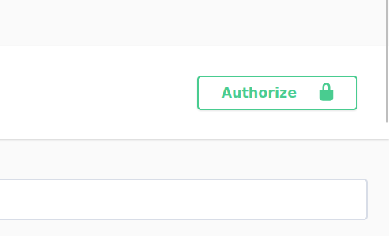

# Ray App
Это маленькое приложение написанное на  `DjangoRestFramework` для создания закладок, 
при введении правильной ссылки на неё. В качестве базы данных стоит `PostgreSQL`. Также есть 
кеширование на базе `redis` и простенькая авторизация с `access_token`.                                 
## Запуск приложения 
Сначала склонируйте этот проект у себя локально. 
Проект использует `poetry` для управления зависимостями.
```shell
poetry install
```
Также у себя локально надо настроить `.env` файл. Все значения 
которые потребуются для запуска проекта были указаны в `.env.example`

Используйте ``` python manage.py runserver``` для запуска приложения.
Затем перейдите по ссылке `http://127.0.0.1:8000/docs/` чтобы ознакомится с API
и документациям к ним. 

Для того чтобы создать `bookmarks` сначала надо зарегистрироваться. 
После успешной регистрации вы получаете `access_token` который надо будет добавить сюда



Здесь будет поле `value` туда надо добавить это значение `Token <и ваш полученный access_token>` 
После этого вы можете создавать, смотреть, обновлять и удалять свои `bookmarks`
Чтобы создать `bookmarks` надо вводить правильную ссылку на какую-либо новость или статью.
`К примеру: https://www.unian.net/games/gta-6-pervyy-treyler-igra-vyydet-v-2025-godu-12475011.html`
`А если будет https://www.unian.net/games . Он не сработает, так как там отсутсвуют мета данные которые нужны 
для создания закладок.`

## Запуск фоновых задач
Для работы с фоновыми задачами был выбран `huey` и `redis`  в качестве брокера сообщений.
В данном приложении была реализована только одна фоновая задача, которая обновляет список закладок 
пользователя, проверяя на подлинность ссылки, если ее не существует, то она автоматически удаляется.

Для запуска фоновой задачи надо набрать команду в терминале:
```shell
python manage.py run_huey
```
## Запуск тестов
Здесь было использовано `pytest` для тестирования и чтобы запустить его надо прописать в терминале команду:
```shell
pytest
```